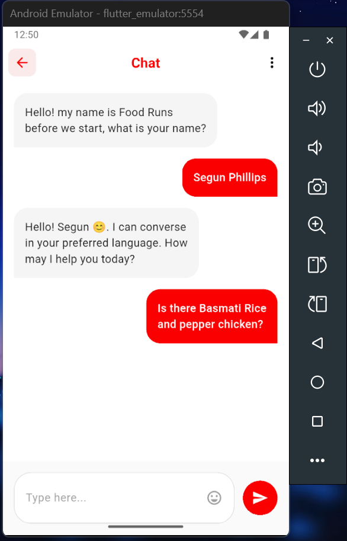
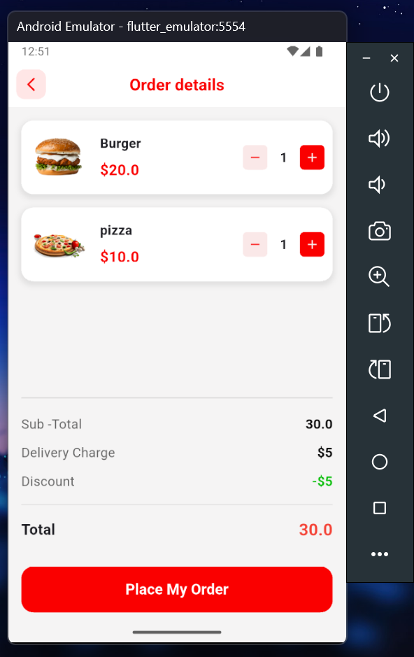
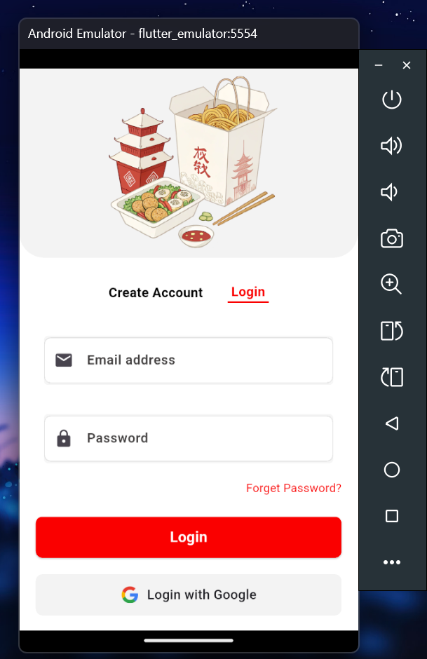

# 🍔 Food E-Commerce Flutter App

## 📱 About This Project
I'm building a food delivery e-commerce mobile application using **Flutter** and **Dart**. This is my daily Flutter learning and development project where I implement new features and improve the app every day.

## 🎯 Current Status
- **Project Start Date**: October 27, 2024
- **Development Status**: Active Development
- **Update Frequency**: Daily

## 🚀 What I'm Working On
I'm learning Flutter by building this food ordering app from scratch. Each day I add new features, fix bugs, and improve the UI/UX.

## 📱 Features (So Far)
✅ User authentication (Login/Signup)  
✅ Arabic language support with RTL layout  
✅ Custom fonts  
✅ SVG image support for logos  
✅ Navigation between screens  
✅ Beautiful UI with Material Design  
✅ Custom styled buttons and forms  

## 🛠️ Tech Stack
- **Framework**: Flutter 3.x
- **Language**: Dart
- **State Management**: StatelessWidget (currently)
- **IDE**: Visual Studio Code
- **Version Control**: Git

## 📅 Daily Updates
I commit code daily to track my progress and learning journey. Each day brings new Flutter concepts and features to the app.

## 🎨 Design Goals
- Clean, modern UI
- Smooth animations
- Responsive design
- Arabic/English support
- User-friendly experience

## 🔮 Future Plans
- Add shopping cart functionality
- Implement payment system
- Add restaurant listings
- Include food categories
- Add user reviews
- Real-time order tracking

## 📱 Screens Developed
1. Login Screen
2. Sign Up Screen
3. Home Screen (in progress)

## 🤝 About Me
I'm learning Flutter development and using this project to practice my skills. This README will be updated regularly as the project evolves.

### All App Screenshots

#### Row 1
<table>
  <tr>
    <td></td>
    <td></td>
    <td></td>
    <td></td>
  </tr>
</table>

#### Row 2  
<table>
  <tr>
    <td></td>
    <td></td>
    <td></td>
    <td></td>
  </tr>
</table>
---

**📌 Note**: This is a learning project. The app is under active development and will be updated daily with new features and improvements.

*Last Updated: December 27, 2025*